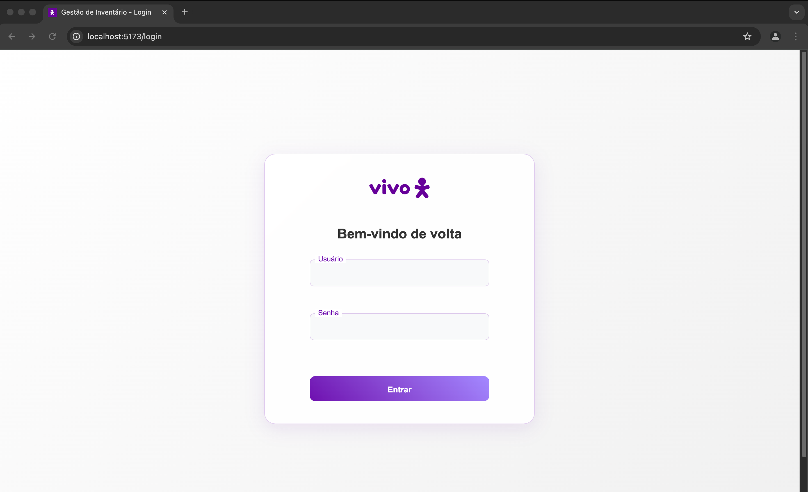

# Login e Alteração de Senha

## Tela de Login

A tela de login é o ponto de entrada do sistema. Para acessar, siga os passos:

1. Digite seu nome de usuário
2. Digite sua senha
3. Clique no botão "Entrar"

## Alteração de Senha

Para alterar sua senha:

1. Após fazer login, clique no seu nome no menu superior
2. Selecione "Alterar Senha"
3. Digite sua senha atual
4. Digite sua nova senha
5. Confirme sua nova senha
6. Clique em "Salvar"

**Requisitos de Senha:**
- Mínimo de 8 caracteres
- Pelo menos uma letra maiúscula
- Pelo menos uma letra minúscula
- Pelo menos um número
- Pelo menos um caractere especial
